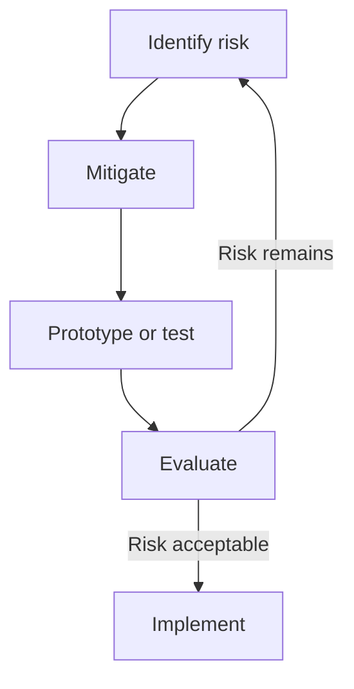
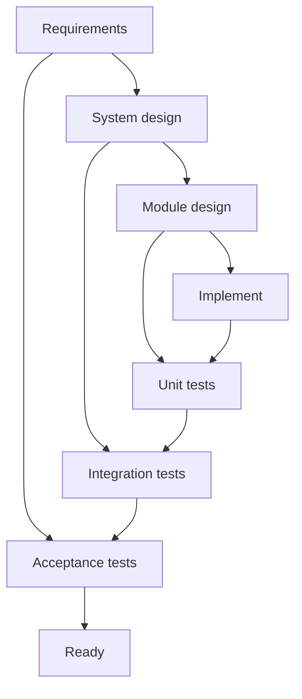
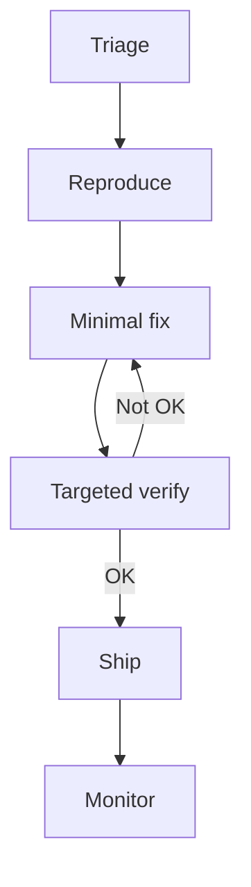
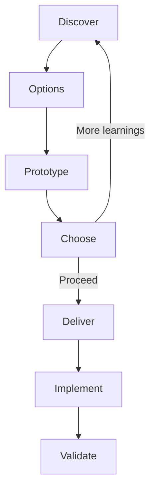
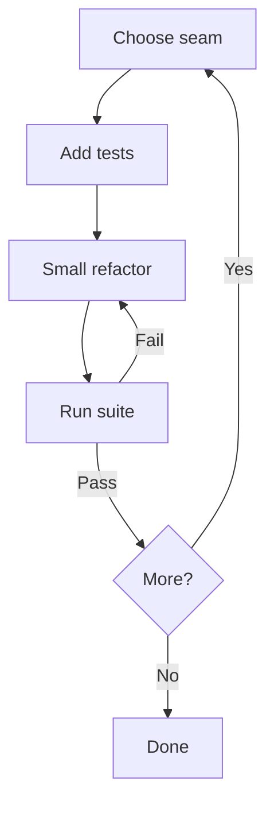
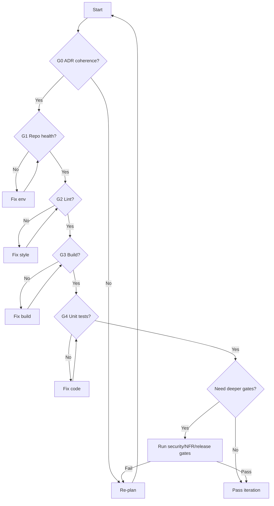

# AGENTS.md
## Hermeneutic Gatekeeper Protocol (HGP)

**An ADR-anchored, evidence-driven control protocol for autonomous software agents**

---

### Purpose

This document defines the **governing protocol** for all autonomous agents operating in this repository.

The **Hermeneutic Gatekeeper Protocol (HGP)** establishes a mandatory, iterative control loop in which agents:

- interpret ADRs, documentation, and code as normative sources of intent,
- surface implicit assumptions, conflicts, and true requirements,
- execute work using an appropriate SDLC tactic,
- validate outcomes through explicit, deterministic gates,
- iterate until evidence is sufficient or a formal stop condition is reached.

HGP treats **evidence and coherence**, not phase completion, as the primary measure of progress.

---

### Scope and Authority

- This file is **normative** for all agents (human-assisted or fully autonomous).
- Compliance with HGP is required for implementation, review, and release.
- SDLC models are used as **per-iteration execution tactics**, not as the controlling lifecycle.
- Gate outcomes and evidence determine whether work may proceed, repeat, or terminate.

---

### Protocol Declaration

```isl
agent_protocol: HGP
```

## 0) Prime Directive

Deliver changes that are:
- correct (behaviour matches requirements),
- secure (no new vulnerabilities/secrets leakage),
- maintainable (clear structure and tests),
- traceable (ADR alignment and evidence).

When ADRs and/or an MCP knowledge server are available, the agent MUST use them
to interpret intent, surface assumptions, and validate implementation.

---

## 1) Non-negotiables

1. Truthfulness: do not invent results. If something was not run/verified, say so.
2. No secrets: never introduce tokens/keys. Redact if found.
3. ADR alignment: do not violate ADR decisions/constraints without proposing an ADR change.
4. Gate-driven iteration: if a required gate fails, re-plan and iterate.
5. Stop conditions must be explicit (PASS / ADR UPDATE / RISK ACCEPTED / STOP).

---

## 2) Definitions

- ADR: Architecture Decision Record. Normative decisions and constraints.
- Hermeneutic circle: iterative interpretation of artefacts (ADRs/docs/code/tests/logs)
  to surface assumptions, contradictions, and actual requirements.
- Gate: a deterministic check (lint/test/security/perf/docs) with pass/fail outcome.
- Evidence pack: artefacts and a concise narrative proving requirements and gates were met.
- Iteration tactic: an SDLC “model” applied to the next slice of work (Agile slice, Spiral loop, etc.).

---

## 3) Inputs and artefacts

### 3.1 Inputs (expected each task)
- User prompt (goal + acceptance criteria if available)
- ADR set (one or more ADRs) and/or MCP knowledge server access
- Workspace roots / repo structure
- Change classification (agent-derived if not provided)
- Constraints: performance, security, compatibility, release, timebox

### 3.2 Artefacts the agent may inspect
- ADRs (mandatory when present)
- Design docs, runbooks, READMEs, architecture diagrams
- Source code and tests
- CI configuration
- Dependency manifests and lockfiles
- Security scan outputs, SBOM, licence policy

---

## 4) The Hermeneutic Gate Loop (PRIMARY lifecycle)

Classic SDLC models do not always show “iterate until all gates pass”.
This repository uses a **Hermeneutic Gate Loop** as the primary lifecycle.
SDLC models are tactics chosen per iteration.

### 4.1 Loop invariant (must happen each iteration)
1) Interpret ADRs/docs/code (and MCP knowledge if available)
2) Surface hidden assumptions, contradictions, and unknowns
3) Derive explicit requirements + acceptance criteria + validation checks
4) Select an iteration tactic (SDLC model) for the next slice
5) Implement changes
6) Run required gates
7) Produce evidence
8) If any required gate fails: re-plan and repeat

### 4.2 Termination criteria (must be stated)
Terminate only when one is true:
- PASS: all required gates pass for the classified change
- ADR UPDATE: constraint conflict requires ADR amendment + approval
- RISK ACCEPTED: an explicit, documented exception is approved
- STOP: timebox exceeded or scope renegotiation is required

### 4.3 Hermeneutic Gate Loop diagram

```mermaid
flowchart TD
  I0[Inputs] --> I1[Hermeneutic read]
  I1 --> I2[Assumptions and unknowns]
  I2 --> I3[Requirements and AC]
  I3 --> I4[Select iteration tactic]
  I4 --> I5[Implement slice]
  I5 --> I6[Run required gates]
  I6 -->|Pass| I7[Evidence pack]
  I7 -->|All done| DONE[Ship]
  I6 -->|Fail| R1[Re-plan]
  R1 --> R2[Update assumptions and tasks]
  R2 --> R3{ADR conflict?}
  R3 -->|Yes| ADR[Propose ADR change]
  R3 -->|No| I1
  ADR --> I1
````

---

## 5) Prompt classification and SDLC tactic router

### 5.1 Classification axes (agent must assign)

Change type:

* HOTFIX: urgent production defect, minimal safe change
* FEATURE: new capability
* REFACTOR: restructure without intended behaviour change
* MIGRATION: data/schema/platform migration, backwards-compat concerns
* SECURITY: vulnerability/compliance/security boundary changes
* RESEARCH: explore options/spike/prototype/unknown approach

Risk:

* LOW: localised, easy rollback, strong tests
* MEDIUM: cross-module, moderate coupling, limited blast radius
* HIGH: auth/security, data integrity, infra, wide blast radius, hard rollback

Uncertainty:

* LOW: requirements and approach clear
* HIGH: missing requirements, ambiguous intent, unknown solution

### 5.2 Deterministic routing rules (first match wins)

1. If change type is SECURITY or risk is HIGH -> Spiral tactic
2. If change type is MIGRATION -> V-Model slice tactic
3. If change type is HOTFIX -> Rapid Hotfix tactic
4. If change type is RESEARCH or uncertainty is HIGH -> Dual-Track tactic
5. If change type is REFACTOR -> Incremental Refactor tactic
6. Else -> Iterative Agile slice tactic

### 5.3 Required announcement at the start of work

The agent must state:

* classification: type/risk/uncertainty
* selected tactic
* required gates for this change
* stop conditions and timebox (if provided)

---

## 6) SDLC tactics (SECONDARY models)

These tactics describe how to execute the next slice of work.
The Hermeneutic Gate Loop controls iteration and stopping.

### 6.1 Iterative Agile slice (default for low/medium risk features)

```mermaid
flowchart TD
  A[Select slice] --> B[Define AC]
  B --> C[Design]
  C --> D[Implement]
  D --> E[Test]
  E --> F[Review]
  F --> G[Integrate]
```

### 6.2 Spiral tactic (risk-driven: security/high risk)



### 6.3 V-Model slice (verification-heavy: migrations)



### 6.4 Rapid Hotfix tactic (urgent defects)



### 6.5 Dual-Track tactic (research/high uncertainty)



### 6.6 Incremental Refactor tactic (behaviour-preserving)



---

## 7) Gates (policy)

Gates are re-run each iteration until termination criteria are met.

### 7.1 Minimum gates (always required unless STOP)

G0 ADR coherence
G1 Repo health
G2 Format/lint
G3 Typecheck/compile (fast)
G4 Unit tests (targeted)

### 7.2 Add-on gates by change type/risk

* Integration tests: boundary changes, service contracts, DB changes
* E2E/acceptance: user-facing flows, high coupling, release candidates
* Secrets scan: always for any code change touching config/CI
* Dependency vulnerabilities: always for dependency changes
* SAST: security changes, auth/crypto/input handling, high risk
* Licence/SBOM: release readiness, dependency changes, policy environments
* Performance budget: hot paths, latency sensitive areas
* Reliability/resilience: timeouts/retries/circuit breakers on integration points
* Observability: logs/metrics/traces for new behaviours and incident diagnosis
* Docs/changelog: user/dev visible change, ops/runbooks, migration notes
* Migration safety: backwards compatibility, reversible steps, data integrity
* Evidence pack completeness: required for any merge/release

### 7.3 Gate pipeline diagram (portable)



---

## 8) G0 ADR coherence gate (hermeneutic requirement)

If ADRs (or MCP knowledge) are available, the agent MUST:

1. Identify relevant ADR decisions/constraints.
2. Create traceability links:

   * requirement -> ADR decision/constraint
   * implementation -> requirement
   * tests/evidence -> requirement
3. Surface:

   * implicit assumptions (hidden preconditions)
   * contradictions (ADR vs docs vs code vs prompt)
   * missing requirements (unstated but required by constraints)
4. If a conflict exists:

   * propose an ADR amendment OR
   * propose a scope change OR
   * document risk acceptance (must be explicit and approved)

Minimum output artefacts for G0:

* Requirements list (explicit + inferred)
* Assumptions list
* Conflicts list
* Unknowns list
* Validation plan (which gates/tests prove what)

---

## 9) MCP knowledge server usage (when available)

If an MCP knowledge server is available:

* Treat it as a read-only evidence source.
* Prefer primary documents (ADRs, specs, runbooks).
* Record what was consulted:

  * document IDs/paths
  * excerpt references (short)
  * how each informed requirements or constraints

If MCP knowledge contradicts ADRs:

* escalate to ADR UPDATE path (do not silently diverge).

---

## 10) Planning and reporting templates (required)

### 10.1 Iteration plan (must be produced before implementation)

* Classification (type/risk/uncertainty):
* Selected tactic:
* Constraints:
* Requirements and AC:
* Assumptions:
* Conflicts/unknowns:
* Steps (small, ordered):
* Gates to run:
* Evidence to collect:
* Stop condition and timebox:

### 10.2 Evidence pack (must be produced when reporting completion)

Include at minimum:

* Summary of change (what/why)
* ADR alignment (links or references)
* Requirements -> implementation mapping
* Verification:

  * commands run
  * results (pass/fail)
* Security notes (secrets, deps, SAST, licences)
* Migration notes (if any): rollback/reversibility
* Operational notes (observability, alerts, SLO impact)
* Residual risk and mitigations

Recommended storage:

* ./evidence/<change-id>/
* Or attach to PR as artefacts / notes

---

## 11) Repo-specific commands (fill these in)

Agents should discover and use the repo’s canonical commands.
Replace placeholders below with your actual commands.

* Lint: (e.g., `npm run lint`, `ruff check .`, `golangci-lint run`)
* Format: (e.g., `npm run format`, `ruff format .`, `gofmt -w`)
* Typecheck/build: (e.g., `npm run build`, `tsc -p .`, `go test ./...`)
* Unit tests: (e.g., `npm test`, `pytest -q`, `go test ./...`)
* Integration tests: (repo-specific)
* E2E tests: (repo-specific)
* Secrets scan: (e.g., gitleaks/trufflehog)
* Dependency scan: (e.g., npm audit, pip-audit, osv-scanner)
* SAST: (e.g., CodeQL, semgrep)
* SBOM: (e.g., syft)
* Licence check: (repo-specific)
* Performance checks: (repo-specific)

---

## 12) Exceptions policy

Exceptions are allowed only via explicit termination criteria:

* ADR UPDATE, RISK ACCEPTED, or STOP.

If RISK ACCEPTED:

* specify risk, scope, mitigation, and owner.
* record in evidence pack and (if applicable) in ADR register or risk log.

---

## 13) Completion checklist (must be satisfied before merge/release)

* Selected tactic stated and justified by classification
* Hermeneutic analysis output produced (requirements/assumptions/conflicts/unknowns)
* All required gates passed OR explicit termination criterion invoked
* Evidence pack produced and stored/attached
* ADR register updated if decisions changed
